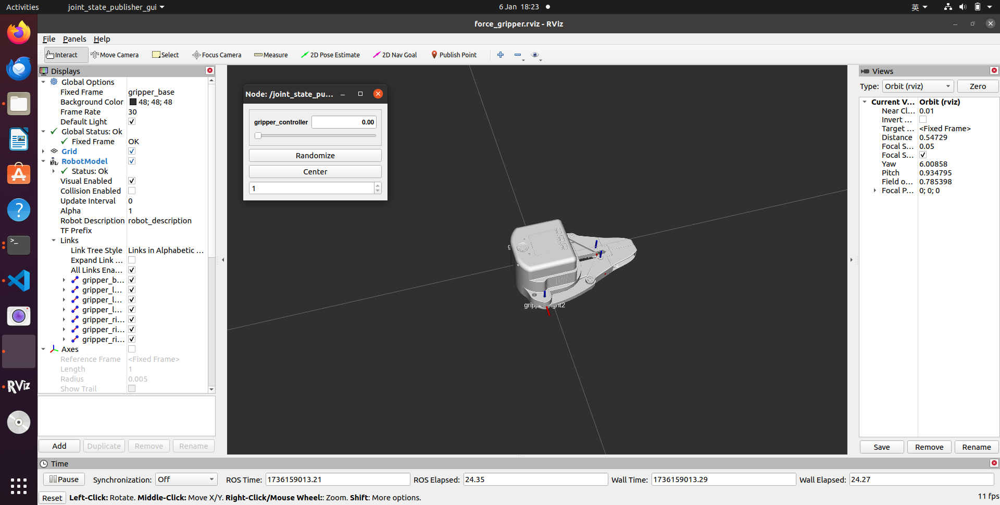

# pro_gripper_ros
Individually control myGripper F100 Pro force-controlled gripper using ROS

Use the `elegripper` API to send angles directly to the real gripper.

   

[elegripper API说明](https://github.com/elephantrobotics/elegripper/blob/main/README.md) | [elegripper API Description](https://github.com/elephantrobotics/elegripper/blob/main/README_EN.md)



## Package Download and Install

Install ros package in your src folder of your Catkin workspace.

```bash
$ cd ~/catkin_ws/src
$ git clone https://github.com/elephantrobotics/pro_gripper_ros.git
$ cd ~/catkin_ws
$ catkin_make
$ source ~/catkin_ws/devel/setup.bash
$ sudo echo 'source ~/catkin_ws/devel/setup.bash' >> ~/.bashrc
```

## Run

>> **Note:** Make sure to grant serial port permissions before running,the default serial port is /dev/ttyACM0, which can be modified according to the actual serial port

### slider control gripper

```bash
roslaunch pro_gripper_f100 force_gripper_slider.launch
```

```bash
rosrun pro_gripper_f100 force_gripper_slider.py _port:=/dev/ttyACM0 _baud:=115200
```

## URDF Model Graph

[myGripper F100 Pro force gripper](../pro_gripper_ros/gripper_description/urdf/force_control_gripper/pro_force_gripper.urdf)

